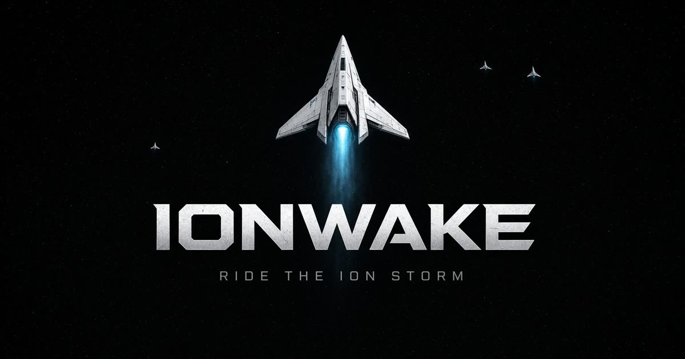
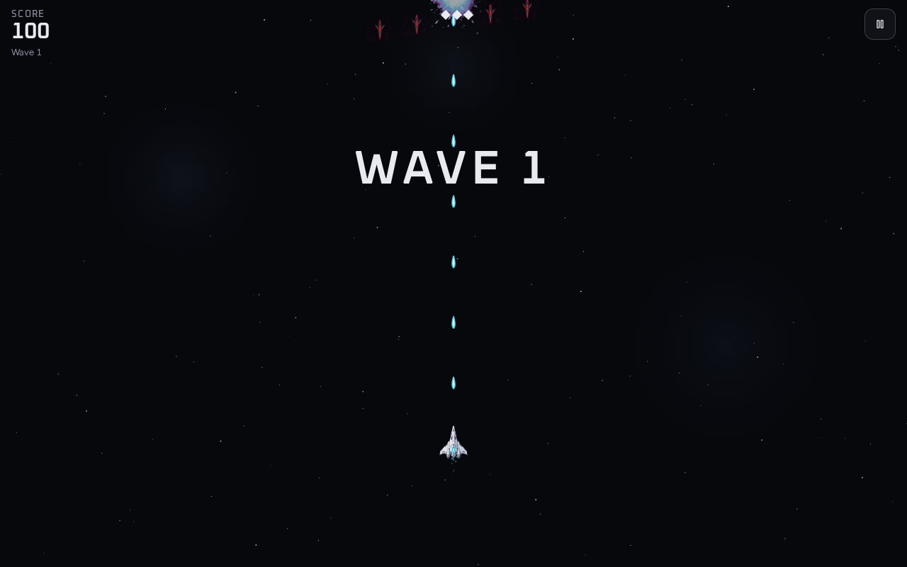

# Ionwake

**Ride the ion storm.**

Play at [ionwake.pmcclel.land](https://ionwake.pmcclel.land).

A top-down arcade shooter. Break the incoming fleet, chain combos, and grab
multi-shot, shield, speed, and the rare nuke. Three lives. Auto-fire is always
on.



<p align="center">
  
</p>

## Play

Open the title screen and hit **Play**. The ship fires on its own — your job is
to stay alive, pick up drops, and ride the combo as waves escalate.

- **Scouts** dart in sine and dive patterns
- **Fighters** seek and return fire
- **Bombers** hold the line every fifth wave and drop loot often
- Enemy HP ticks up every four waves

The arena is a fixed **390×844** playfield, letterboxed on wider screens so a
phone and a laptop share one field. High scores are a shared top-8 board (saved
on the server) plus a local cache. A top-8 run earns a three-letter tag.

## Play together

**Play together** opens a private 2-player room. Copy the link (`/?r=K7Q2`) and
send it to one friend. The host starts the run once they join.

You share waves, score, and lives. Each ship keeps its own guns, shield, speed,
and nukes — host left of center, guest right. Co-op runs do not write the public
high-score board.

The two browsers talk peer-to-peer (WebRTC). The server only brokers the
handshake. Some networks block a direct link; the lobby says so instead of
spinning. Rooms hold two seats — a third visitor is turned away.

## Controls

| Action | Keyboard | Pointer | Gamepad |
| --- | --- | --- | --- |
| Move | WASD or arrow keys | Drag / mouse follow | Left stick or D-pad |
| Fire | Automatic | Automatic | Automatic |
| Nuke | `X` | Bomb button (larger on phones) | B / Circle |
| Pause | `Esc` or `P` | Pause button | Start |
| Fullscreen | `F` | Fullscreen button | — |

The same list sits on the title and pause overlays. Sound mute lives on pause.
Touch drag lifts the ship above your finger so you can still see it; speed
stacks apply to drag the same as they do to WASD.

Fullscreen uses the browser’s native API when it exists (including Chrome on
Android) and an immersive fill on phones that don’t expose it (iPhone).

## Scoring

| Event | Points |
| --- | --- |
| Scout | 100 |
| Fighter | 250 |
| Bomber | 600 |
| Pickup | 50 |
| Wave clear | `(wave − 1) × 250` |

Kills in a 0.7s window raise a combo. Each extra kill multiplies the next by
`1 + combo × 0.1`. Extra life at 10,000 points, then every 15,000 after that.

### Power-ups

| Drop | Effect |
| --- | --- |
| **Multi** | 3-way shot, then 5-way |
| **Shield** | Absorb one hit (stacks to 3) |
| **Speed** | Movement boost (stacks to 2) |
| **Life** | Extra ship |
| **Nuke** | Screen-clear ion burst. Stock up to 2. Press `X`. Rare. |

Bombers drop often, fighters sometimes, scouts rarely. Nukes are the scarce
drop. A hit without a shield resets multi and speed; nukes stay with you.

## Stack

- [React 19](https://react.dev/) + [TanStack Start](https://tanstack.com/start) / Router
- [Vite](https://vite.dev/) + [Tailwind CSS v4](https://tailwindcss.com/)
- Canvas 2D game loop in `src/game/` (fixed 60 Hz step, Web Audio SFX)
- Co-op over WebRTC data channels; `/api/rtc` is signaling only (host-authoritative sim)
- No accounts — the public high-score board lives in Postgres (Neon on deploy, local PGLite in dev)

## Layout

```
src/
  game/                 Canvas engine, HUD overlays, input, audio, save
    GameApp.tsx         Title / lobby / pause / game-over / scores chrome
    engine.ts           Waves, combat, FX, letterboxed world, co-op sim
    coop.ts             Room codes, snapshot wire types
    fullscreen.ts       Native fullscreen + immersive phone fill
    input.ts            Keyboard, pointer, standard gamepad
    save.ts             High scores + mute
    sprites.ts          Atlas loader
  lib/multiplayer/      WebRTC rooms + signaling relay
  routes/               `/` mounts the game; `/?r=CODE` joins a room
    api/rtc.ts          Signaling handshake
  styles.css            Dark arcade tokens (Oxanium + Figtree)
public/sprites/         Runtime ship, enemy, bolt, FX, and pickup art
assets/sprites/         Source sheets + magenta chroma pipeline
screenshots/            Captured title, play, pause, and score screens
```

## Development

Requires **Node 22** and npm.

```bash
npm install
npm run dev
```

The dev server listens on `0.0.0.0:8080`.

```bash
npm run typecheck
npm run build
npm run preview          # production build, loopback :8081
npm test
```

| Script | What it does |
| --- | --- |
| `npm run dev` | Vite + TanStack Start, HMR |
| `npm run build` | Production bundle |
| `npm run typecheck` | `tsc --noEmit` |
| `npm test` | Node tests under `scripts/` and `src/lib/` |
| `npm run lint` | ESLint |
| `npm run format` | Prettier |

## Sprites

Runtime PNGs live in `public/sprites/`. Source sheets and pipeline metadata are
under `assets/sprites/`. `assets/sprites/chroma.py` keys out magenta backgrounds
and crops generated sheets into square sprites.

```
public/sprites/
  player.png  scout.png  fighter.png  bomber.png
  player-bolt.png  enemy-bolt.png
  explode-1.png … explode-4.png
  muzzle-1.png … muzzle-4.png
  power-multi.png  power-shield.png  power-speed.png  power-life.png
  power-nuke.png
```
